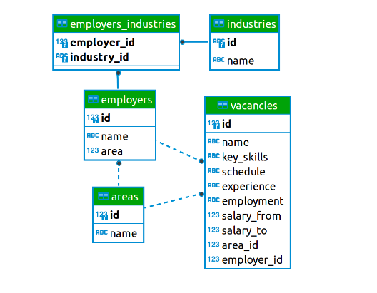
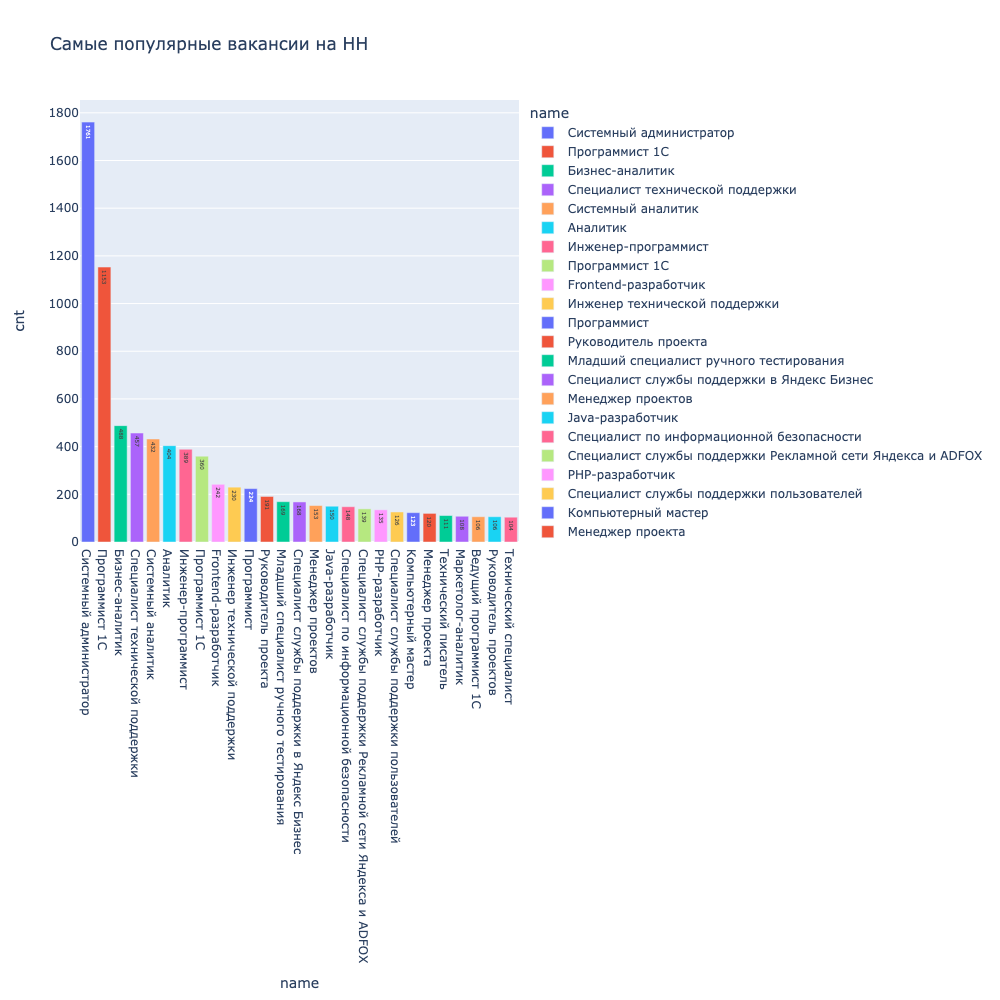

# 
Анализ базы данных вакансиями c Head Hunter
## Оглавление
[1. Описание проекта](#описание-проекта)  
[2. Краткая информация о данных](#краткая-информация-о-данных)  
[3. Этапы работы над проектом](#этапы-работы-над-проектом)  
[4. Результат](#результат)  
​
### Описание проекта    
Представьте, что вы устроились на работу в кадровое агентство, которое подбирает вакансии для IT-специалистов. Ваш первый проект — создание модели машинного обучения, которая будет рекомендовать вакансии клиентам агентства, претендующим на позицию Data Scientist. Сначала вам необходимо понять, что из себя представляют данные и насколько они соответствуют целям проекта. В литературе эта часть работы над ML-проектом называется Data Understanding, или анализ данных.

​​

### Краткая информация о данных
Все необходимые таблицы находятся в схеме public базы данных project_sql.

 

​
### Этапы работы над проектом  

Проект включает в себя несколько этапов:
* знакомство с данными;
* предварительный анализ данных;
* детальный анализ вакансий;
* анализ работодателей;
* предметный анализ.

​​

### Результат
[Ноутбук с выполненными заданиями и выводами](Project_2_HH.ipynb)

График из ноутбука (также загружен html для отображения в jupyter notebook в папку plotly)

 
​​

Если информация по этому проекту покажется вам интересной или полезной, то я буду очень вам благодарна, если отметите репозиторий и профиль ⭐️⭐️⭐️-дами
